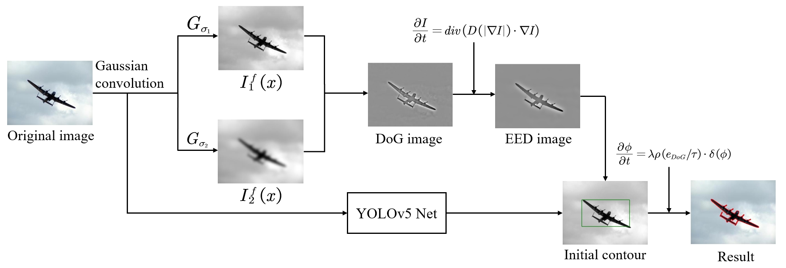
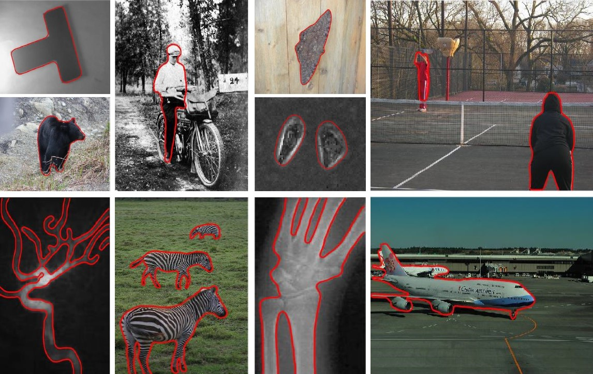

# Anisotropic edge-enhanced active contour model with Gaussian difference for robust multi-category image segmentation




## Brief start

This paper introduces an advanced segmentation method, DoG&EED, for robust multi-category image segmentation. 
We propose an architecture that uses the bounding box output by the object detection algorithm as the initial contour of the active contour model (ACM), and evolves the contour by optimizing the energy function to achieve natural image segmentation.
The object detection algorithm adopted here is YOLOv5. ACM is designed based on Gaussian difference operator (DoG) and edge-enhanced equation (EED) to better overcome noise and locate boundaries, with excellent overall performance.
Of course, the detection network can be replaced, readers are welcome to have a try!

## Installation

Open "Anaconda prompt"
```
conda create -n DoGEED python=3.8
conda activate DoGEED

# install pytorch according to the cuda version
# here cuda version is 12.6, pytorch version is 1.12.1

pip install torch==1.7.1+cu110 torchvision==0.8.2+cu110 torchaudio==0.7.2
pip install Cython==0.28.2
pip install -r requirements.txt
```

### Testing

Open "main.py" and locate to
```
parser.add_argument('--weights', nargs='+', type=str, default='', help='model.pt path(s)')
parser.add_argument('--source', type=str, default='' + ImgID + '.jpg', help='source')
image0 = cv2.imread('' + ImgID + '.jpg')
```
Enter the path of the weight after `default=` in the first line, here we enter `yolov5s.pt`.
Enter the path of the source images after `default=` in the second line and `''` in the third line. 
Note that it is an absolute path, such as `C:/xxx/`.
Then, modify ImgID according to the file name.
ACM parameters can be adjusted at will.

### Training
Prepare the dataset and training code according to the [official tutorial](https://github.com/ultralytics/yolov5).


## Performances

The proposed model is tested on a single RTX4090.

Comparison with previous ACMs.

| Methods |  DSI  |  SI   |  JI   | FPS |
|:-------:|:-----:|:-----:|:-----:|-----|
|   ABC   | 0.950 | 0.951 | 0.949 | 2.8 |
|   PBC   | 0.947 | 0.949 | 0.951 | 0.9 |
|  APFJD  | 0.952 | 0.952 | 0.952 | 1.1 |
|   RPR   | 0.949 | 0.949 | 0.954 | 3.9 |
|  LPPF   | 0.955 | 0.956 | 0.958 | 5.6 |
|  LKLD   | 0.956 | 0.957 | 0.958 | 5.5 |
| DoG&EED | 0.960 | 0.961 | 0.963 | 7.2 |

Comparison with deep learning models on the COCO benchmark. Pc and IoU are chosen as the metrics.

|  Methods   |    plane    |    human    |    bear     |    zebra    | clock       | ship        | bus         | dog         |
|:----------:|:-----------:|:-----------:|:-----------:|:-----------:|-------------|-------------|-------------|-------------|
|    E2EC    | 87.5 / 77.1 | 88.9 / 79.2 | 95.0 / 87.9 | 88.9 / 80.0 | 87.8 / 80.0 | 82.1 / 86.8 | 85.6 / 83.4 | 90.2 / 88.5 |
| Mask R-CNN | 87.8 / 75.9 | 75.8 / 58.1 | 89.9 / 82.5 | 88.2 / 78.1 | 82.5 / 81.4 | 82.4 / 69.3 | 68.4 / 73.9 | 87.1 / 84.6 |
| BlendMask  | 86.4 / 90.5 | 82.6 / 67.6 | 90.7 / 82.2 | 80.2 / 64.3 | 72.2 / 55.2 | 92.2 / 84.8 | 88.6 / 85.5 | 91.4 / 89.9 |
|  DoG&EED   | 90.4 / 81.8 | 92.3 / 86.0 | 89.5 / 89.3 | 90.0 / 78.1 | 88.9 / 74.0 | 91.9 / 87.0 | 71.3 / 79.5 | 90.3 / 93.8 |


## Citation


